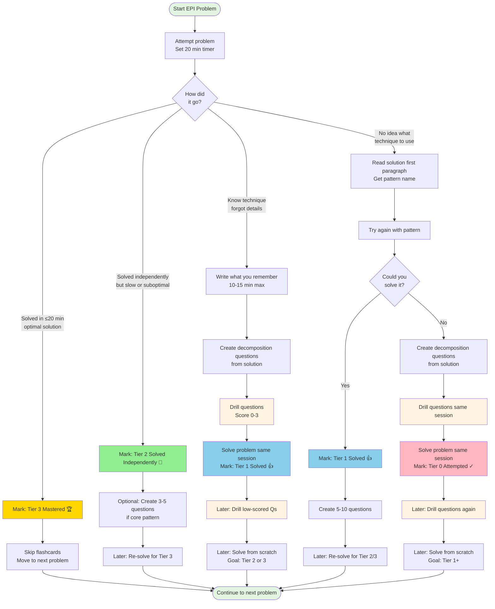
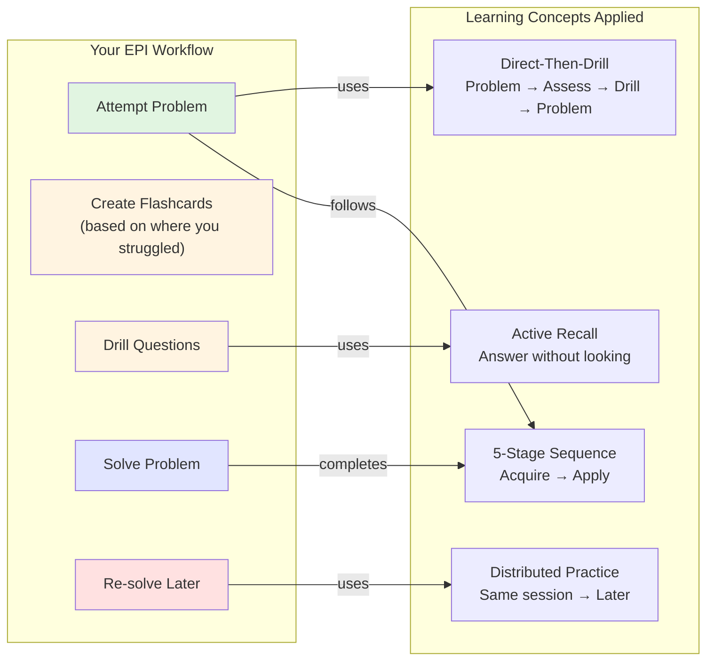
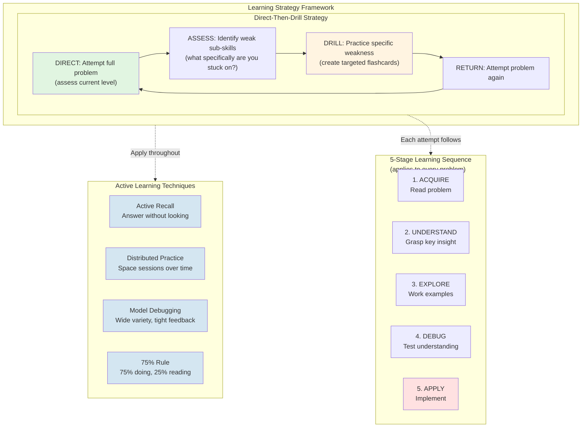

# Python Coding Dojo

My journey through Elements of Programming Interviews in Python.

## Overall Progress

### Tier 0: Attempted ✓
Problems attempted but not yet solved

✓✓✓✓✓✓✓✓✓✓✓✓✓✓✓✓✓✓✓⬜
⬜⬜⬜⬜⬜⬜⬜⬜⬜⬜⬜⬜⬜⬜⬜⬜⬜⬜⬜⬜
⬜⬜⬜⬜⬜⬜⬜⬜⬜⬜⬜⬜⬜⬜⬜⬜⬜⬜⬜⬜
⬜⬜⬜⬜⬜⬜⬜⬜⬜⬜⬜⬜⬜⬜⬜⬜⬜⬜⬜⬜
⬜⬜⬜⬜⬜⬜⬜⬜⬜⬜⬜⬜⬜⬜⬜⬜⬜⬜⬜⬜
⬜⬜⬜⬜⬜⬜⬜⬜⬜⬜⬜⬜⬜⬜⬜⬜⬜⬜⬜⬜
⬜⬜⬜⬜⬜⬜⬜⬜⬜⬜⬜⬜⬜⬜⬜⬜⬜⬜⬜⬜
⬜⬜⬜⬜⬜⬜⬜⬜⬜⬜⬜⬜⬜⬜⬜⬜⬜⬜⬜⬜
⬜⬜⬜⬜⬜⬜⬜⬜⬜⬜⬜⬜⬜⬜⬜⬜⬜⬜⬜⬜
⬜⬜⬜⬜⬜⬜⬜⬜⬜⬜⬜⬜⬜⬜⬜⬜⬜⬜⬜⬜
⬜⬜⬜⬜

**19 / 204** (9.3%)

### Tier 1: Solved 👍
Problems solved (with or without help)

👍👍👍👍👍👍👍👍👍👍👍👍👍👍👍👍⬜⬜⬜⬜
⬜⬜⬜⬜⬜⬜⬜⬜⬜⬜⬜⬜⬜⬜⬜⬜⬜⬜⬜⬜
⬜⬜⬜⬜⬜⬜⬜⬜⬜⬜⬜⬜⬜⬜⬜⬜⬜⬜⬜⬜
⬜⬜⬜⬜⬜⬜⬜⬜⬜⬜⬜⬜⬜⬜⬜⬜⬜⬜⬜⬜
⬜⬜⬜⬜⬜⬜⬜⬜⬜⬜⬜⬜⬜⬜⬜⬜⬜⬜⬜⬜
⬜⬜⬜⬜⬜⬜⬜⬜⬜⬜⬜⬜⬜⬜⬜⬜⬜⬜⬜⬜
⬜⬜⬜⬜⬜⬜⬜⬜⬜⬜⬜⬜⬜⬜⬜⬜⬜⬜⬜⬜
⬜⬜⬜⬜⬜⬜⬜⬜⬜⬜⬜⬜⬜⬜⬜⬜⬜⬜⬜⬜
⬜⬜⬜⬜⬜⬜⬜⬜⬜⬜⬜⬜⬜⬜⬜⬜⬜⬜⬜⬜
⬜⬜⬜⬜⬜⬜⬜⬜⬜⬜⬜⬜⬜⬜⬜⬜⬜⬜⬜⬜
⬜⬜⬜⬜

**16 / 204** (7.8%)

### Tier 2: Solved Independently 💪
Problems solved without hints or looking at solutions

💪💪💪💪💪💪💪💪💪💪⬜⬜⬜⬜⬜⬜⬜⬜⬜⬜
⬜⬜⬜⬜⬜⬜⬜⬜⬜⬜⬜⬜⬜⬜⬜⬜⬜⬜⬜⬜
⬜⬜⬜⬜⬜⬜⬜⬜⬜⬜⬜⬜⬜⬜⬜⬜⬜⬜⬜⬜
⬜⬜⬜⬜⬜⬜⬜⬜⬜⬜⬜⬜⬜⬜⬜⬜⬜⬜⬜⬜
⬜⬜⬜⬜⬜⬜⬜⬜⬜⬜⬜⬜⬜⬜⬜⬜⬜⬜⬜⬜
⬜⬜⬜⬜⬜⬜⬜⬜⬜⬜⬜⬜⬜⬜⬜⬜⬜⬜⬜⬜
⬜⬜⬜⬜⬜⬜⬜⬜⬜⬜⬜⬜⬜⬜⬜⬜⬜⬜⬜⬜
⬜⬜⬜⬜⬜⬜⬜⬜⬜⬜⬜⬜⬜⬜⬜⬜⬜⬜⬜⬜
⬜⬜⬜⬜⬜⬜⬜⬜⬜⬜⬜⬜⬜⬜⬜⬜⬜⬜⬜⬜
⬜⬜⬜⬜⬜⬜⬜⬜⬜⬜⬜⬜⬜⬜⬜⬜⬜⬜⬜⬜
⬜⬜⬜⬜

**10 / 204** (4.9%)

### Tier 3: Mastered 🏆
Problems solved independently in ≤20 minutes with optimal solution

🏆🏆🏆🏆🏆🏆🏆⬜⬜⬜⬜⬜⬜⬜⬜⬜⬜⬜⬜⬜
⬜⬜⬜⬜⬜⬜⬜⬜⬜⬜⬜⬜⬜⬜⬜⬜⬜⬜⬜⬜
⬜⬜⬜⬜⬜⬜⬜⬜⬜⬜⬜⬜⬜⬜⬜⬜⬜⬜⬜⬜
⬜⬜⬜⬜⬜⬜⬜⬜⬜⬜⬜⬜⬜⬜⬜⬜⬜⬜⬜⬜
⬜⬜⬜⬜⬜⬜⬜⬜⬜⬜⬜⬜⬜⬜⬜⬜⬜⬜⬜⬜
⬜⬜⬜⬜⬜⬜⬜⬜⬜⬜⬜⬜⬜⬜⬜⬜⬜⬜⬜⬜
⬜⬜⬜⬜⬜⬜⬜⬜⬜⬜⬜⬜⬜⬜⬜⬜⬜⬜⬜⬜
⬜⬜⬜⬜⬜⬜⬜⬜⬜⬜⬜⬜⬜⬜⬜⬜⬜⬜⬜⬜
⬜⬜⬜⬜⬜⬜⬜⬜⬜⬜⬜⬜⬜⬜⬜⬜⬜⬜⬜⬜
⬜⬜⬜⬜⬜⬜⬜⬜⬜⬜⬜⬜⬜⬜⬜⬜⬜⬜⬜⬜
⬜⬜⬜⬜

**7 / 204** (3.4%)

## Goals

Progress toward priority-based learning goals.

### 🔴 P0: Attempt All (16/16 - 100%)

✓✓✓✓✓✓✓✓✓✓✓✓✓✓✓✓

**16 / 16** problems attempted

### 🔴 P0: Master All (6/16 - 38%)

🏆🏆🏆🏆🏆🏆⬜⬜⬜⬜⬜⬜⬜⬜⬜⬜

**6 / 16** problems mastered

### 🟠 P1: Attempt All (0/21 - 0%)

⬜⬜⬜⬜⬜⬜⬜⬜⬜⬜⬜⬜⬜⬜⬜⬜⬜⬜⬜⬜
⬜

**0 / 21** problems attempted

### 🟠 P1: Master All (0/21 - 0%)

⬜⬜⬜⬜⬜⬜⬜⬜⬜⬜⬜⬜⬜⬜⬜⬜⬜⬜⬜⬜
⬜

**0 / 21** problems mastered

### 🟡 P2: Attempt All (0/22 - 0%)

⬜⬜⬜⬜⬜⬜⬜⬜⬜⬜⬜⬜⬜⬜⬜⬜⬜⬜⬜⬜
⬜⬜

**0 / 22** problems attempted

### 🟡 P2: Master All (0/22 - 0%)

⬜⬜⬜⬜⬜⬜⬜⬜⬜⬜⬜⬜⬜⬜⬜⬜⬜⬜⬜⬜
⬜⬜

**0 / 22** problems mastered

### 🟢 P3: Attempt All (1/25 - 4%)

✓⬜⬜⬜⬜⬜⬜⬜⬜⬜⬜⬜⬜⬜⬜⬜⬜⬜⬜⬜
⬜⬜⬜⬜⬜

**1 / 25** problems attempted

### 🟢 P3: Master All (0/25 - 0%)

⬜⬜⬜⬜⬜⬜⬜⬜⬜⬜⬜⬜⬜⬜⬜⬜⬜⬜⬜⬜
⬜⬜⬜⬜⬜

**0 / 25** problems mastered

### 🔵 P4: Attempt All (0/20 - 0%)

⬜⬜⬜⬜⬜⬜⬜⬜⬜⬜⬜⬜⬜⬜⬜⬜⬜⬜⬜⬜

**0 / 20** problems attempted

### 🔵 P4: Master All (0/20 - 0%)

⬜⬜⬜⬜⬜⬜⬜⬜⬜⬜⬜⬜⬜⬜⬜⬜⬜⬜⬜⬜

**0 / 20** problems mastered

## Problem-Solving Workflow

### Learning Framework

### Learning Strategy Framework

## Progress by Chapter

| Chapter | Problems | Attempted ✓ | Solved 👍 | Independent 💪 | Mastered 🏆 |
|---------|----------|-------------|--------|---------------|-------------|
| 4: Primitive Types | 11 | 4 (36%) | 4 (36%) | 3 (27%) | 2 (18%) |
| 5: Arrays | 20 | 2 (10%) | 1 (5%) | 1 (5%) | 1 (5%) |
| 6: Strings | 12 | 1 (8%) | 1 (8%) | 1 (8%) | 1 (8%) |
| 7: Linked Lists | 13 | 1 (8%) | 1 (8%) | 1 (8%) | 1 (8%) |
| 8: Stacks and Queues | 9 | 1 (11%) | 1 (11%) | 1 (11%) | 0 (0%) |
| 9: Binary Trees | 15 | 1 (7%) | 0 (0%) | 0 (0%) | 0 (0%) |
| 10: Heaps | 6 | 1 (17%) | 1 (17%) | 0 (0%) | 0 (0%) |
| 11: Searching | 10 | 1 (10%) | 1 (10%) | 1 (10%) | 1 (10%) |
| 12: Hash Tables | 11 | 1 (9%) | 1 (9%) | 1 (9%) | 0 (0%) |
| 13: Sorting | 12 | 1 (8%) | 1 (8%) | 1 (8%) | 1 (8%) |
| 14: Binary Search Trees | 11 | 1 (9%) | 1 (9%) | 0 (0%) | 0 (0%) |
| 15: Recursion | 11 | 1 (9%) | 0 (0%) | 0 (0%) | 0 (0%) |
| 16: Dynamic Programming | 12 | 1 (8%) | 1 (8%) | 0 (0%) | 0 (0%) |
| 17: Greedy Algorithms and Invariants | 8 | 1 (12%) | 1 (12%) | 0 (0%) | 0 (0%) |
| 18: Graphs | 8 | 1 (12%) | 1 (12%) | 0 (0%) | 0 (0%) |
| 24: Honors Class | 35 | 0 (0%) | 0 (0%) | 0 (0%) | 0 (0%) |
| **Total** | **204** | **19** | **16** | **10** | **7** |

## All Problems

### Chapter 4: Primitive Types

| # | Problem | Priority | Status | Best Time |
|---|---------|----------|--------|-----------|
| 4.01 | Computing the parity of a word | 🔴 | 🏆 | 2 min |
| 4.02 | Swap bits |  | 🏆 | 6 min |
| 4.03 | Reverse bits | 🟢 | 💪 | 3 min |
| 4.04 | Find a closest integer with the same weight |  | 👍 |  |
| 4.05 | Compute product without arithmetical operators |  |  |  |
| 4.06 | Compute quotient without arithmetical operators |  |  |  |
| 4.07 | Compute pow(x,y) | 🟠 |  |  |
| 4.08 | Reverse digits | 🟡 |  |  |
| 4.09 | Check if a decimal integer is a palindrome | 🔵 |  |  |
| 4.10 | Generate uniform random numbers |  |  |  |
| 4.11 | Rectangle intersection | 🟢 |  |  |

---

### Chapter 5: Arrays

| # | Problem | Priority | Status | Best Time |
|---|---------|----------|--------|-----------|
| 5.01 | The Dutch national flag problem | 🔴 | ✓ |  |
| 5.02 | Increment an arbitrary-precision integer | 🟡 |  |  |
| 5.03 | Multiply two arbitrary-precision integers | 🔵 |  |  |
| 5.04 | Advancing through an array |  |  |  |
| 5.05 | Delete duplicates from a sorted array | 🟢 |  |  |
| 5.06 | Buy and sell a stock once | 🔴 | 🏆 | 5 min |
| 5.07 | Buy and sell a stock twice |  |  |  |
| 5.08 | Computing an alternation |  |  |  |
| 5.09 | Enumerate all primes to n | 🟢 |  |  |
| 5.10 | Permute the elements of an array | 🔵 |  |  |
| 5.11 | Compute the next permutation |  |  |  |
| 5.12 | Sample offline data | 🟠 |  |  |
| 5.13 | Sample online data |  |  |  |
| 5.14 | Compute a random permutation |  |  |  |
| 5.15 | Compute a random subset | 🔵 |  |  |
| 5.16 | Generate nonuniform random numbers |  |  |  |
| 5.17 | The Sudoku checker problem | 🟡 |  |  |
| 5.18 | Compute the spiral ordering of a 2D array | 🟠 |  |  |
| 5.19 | Rotate a 2D array |  |  |  |
| 5.20 | Compute rows in Pascal's Triangle |  |  |  |

---

### Chapter 6: Strings

| # | Problem | Priority | Status | Best Time |
|---|---------|----------|--------|-----------|
| 6.01 | Interconvert strings and integers | 🔴 | 🏆 | 19 min |
| 6.02 | Base conversion | 🟠 |  |  |
| 6.03 | Compute the spreadsheet column encoding |  |  |  |
| 6.04 | Replace and remove | 🟠 |  |  |
| 6.05 | Test palindromicity | 🟡 |  |  |
| 6.06 | Reverse all the words in a sentence | 🟡 |  |  |
| 6.07 | The look-and-say problem | 🟢 |  |  |
| 6.08 | Convert from Roman to decimal | 🟢 |  |  |
| 6.09 | Compute all valid IP addresses | 🔵 |  |  |
| 6.10 | Write a string sinusoidally |  |  |  |
| 6.11 | Implement run-length encoding | 🔵 |  |  |
| 6.12 | Find the first occurrence of a substring |  |  |  |

---

### Chapter 7: Linked Lists

| # | Problem | Priority | Status | Best Time |
|---|---------|----------|--------|-----------|
| 7.01 | Merge two sorted lists | 🔴 | 🏆 | 3 min |
| 7.02 | Reverse a single sublist | 🟠 |  |  |
| 7.03 | Test for cyclicity | 🟠 |  |  |
| 7.04 | Test for overlapping lists---lists are cycle-free | 🟡 |  |  |
| 7.05 | Test for overlapping lists---lists may have cycles |  |  |  |
| 7.06 | Delete a node from a singly linked list |  |  |  |
| 7.07 | Remove the kth last element from a list | 🟡 |  |  |
| 7.08 | Remove duplicates from a sorted list |  |  |  |
| 7.09 | Implement cyclic right shift for singly linked lists |  |  |  |
| 7.10 | Implement even-odd merge | 🟢 |  |  |
| 7.11 | Test whether a singly linked list is palindromic | 🔵 |  |  |
| 7.12 | Implement list pivoting |  |  |  |
| 7.13 | Add list-based integers |  |  |  |

---

### Chapter 8: Stacks and Queues

| # | Problem | Priority | Status | Best Time |
|---|---------|----------|--------|-----------|
| 8.01 | Implement a stack with max API | 🔴 | 💪 | 3 min |
| 8.02 | Evaluate RPN expressions | 🟡 |  |  |
| 8.03 | Is a string well-formed? | 🟢 |  |  |
| 8.04 | Normalize pathnames | 🔵 |  |  |
| 8.05 | Compute buildings with a sunset view |  |  |  |
| 8.06 | Compute binary tree nodes in order of increasing depth | 🟠 |  |  |
| 8.07 | Implement a circular queue | 🟡 |  |  |
| 8.08 | Implement a queue using stacks | 🟢 |  |  |
| 8.09 | Implement a queue with max API |  |  |  |

---

### Chapter 9: Binary Trees

| # | Problem | Priority | Status | Best Time |
|---|---------|----------|--------|-----------|
| 9.01 | Test if a binary tree is height-balanced | 🔴 | ✓ |  |
| 9.02 | Test if a binary tree is symmetric | 🟡 |  |  |
| 9.03 | Compute the lowest common ancestor in a binary tree |  |  |  |
| 9.04 | Compute the LCA when nodes have parent pointers | 🟠 |  |  |
| 9.05 | Sum the root-to-leaf paths in a binary tree |  |  |  |
| 9.06 | Find a root to leaf path with specified sum |  |  |  |
| 9.07 | Implement an inorder traversal without recursion |  |  |  |
| 9.08 | Compute the kth node in an inorder traversal |  |  |  |
| 9.09 | Compute the successor |  |  |  |
| 9.10 | Implement an inorder traversal with constant space |  |  |  |
| 9.11 | Reconstruct a binary tree from traversal data | 🟢 |  |  |
| 9.12 | Reconstruct a binary tree from a preorder traversal with markers | 🟡 |  |  |
| 9.13 | Compute the leaves of a binary tree | 🔵 |  |  |
| 9.14 | Compute the exterior of a binary tree |  |  |  |
| 9.15 | Compute the right sibling tree |  |  |  |

---

### Chapter 10: Heaps

| # | Problem | Priority | Status | Best Time |
|---|---------|----------|--------|-----------|
| 10.01 | Merge sorted files | 🔴 | 👍 |  |
| 10.02 | Sort an increasing-decreasing array |  |  |  |
| 10.03 | Sort an almost-sorted array | 🟡 |  |  |
| 10.04 | Compute the k closest stars | 🟠 |  |  |
| 10.05 | Compute the median of online data | 🟢 |  |  |
| 10.06 | Compute the k largest elements in a max-heap | 🔵 |  |  |

---

### Chapter 11: Searching

| # | Problem | Priority | Status | Best Time |
|---|---------|----------|--------|-----------|
| 11.01 | Search a sorted array for first occurrence of k | 🔴 | 🏆 | 6 min |
| 11.02 | Search a sorted array for entry equal to its index |  |  |  |
| 11.03 | Search a cyclically sorted array | 🟡 |  |  |
| 11.04 | Compute the integer square root | 🟠 |  |  |
| 11.05 | Compute the real square root | 🟢 |  |  |
| 11.06 | Search in a 2D sorted array | 🔵 |  |  |
| 11.07 | Find the min and max simultaneously | 🔵 |  |  |
| 11.08 | Find the kth largest element | 🟠 |  |  |
| 11.09 | Find the missing IP address | 🟡 |  |  |
| 11.10 | Find the duplicate and missing elements | 🟢 |  |  |

---

### Chapter 12: Hash Tables

| # | Problem | Priority | Status | Best Time |
|---|---------|----------|--------|-----------|
| 12.01 | Test for palindromic permutations | 🟡 |  |  |
| 12.02 | Is an anonymous letter constructible? | 🔴 | 💪 | 4 min |
| 12.03 | Implement an ISBN cache | 🟠 |  |  |
| 12.04 | Compute the LCA, optimizing for close ancestors | 🟢 |  |  |
| 12.05 | Find the nearest repeated entries in an array | 🟠 |  |  |
| 12.06 | Find the smallest subarray covering all values | 🟢 |  |  |
| 12.07 | Find smallest subarray sequentially covering all values |  |  |  |
| 12.08 | Find the longest subarray with distinct entries |  |  |  |
| 12.09 | Find the length of a longest contained interval | 🔵 |  |  |
| 12.10 | Compute all string decompositions |  |  |  |
| 12.11 | Test the Collatz conjecture |  |  |  |

---

### Chapter 13: Sorting

| # | Problem | Priority | Status | Best Time |
|---|---------|----------|--------|-----------|
| 13.01 | Compute the intersection of two sorted arrays | 🔴 | 🏆 | 7 min |
| 13.02 | Merge two sorted arrays | 🟠 |  |  |
| 13.03 | Computing the h-index |  |  |  |
| 13.04 | Remove first-name duplicates |  |  |  |
| 13.05 | Smallest nonconstructible value | 🟡 |  |  |
| 13.06 | Render a calendar |  |  |  |
| 13.07 | Merging intervals | 🟢 |  |  |
| 13.08 | Compute the union of intervals | 🔵 |  |  |
| 13.09 | Partitioning and sorting an array with many repeated entries |  |  |  |
| 13.10 | Team photo day---1 | 🟢 |  |  |
| 13.11 | Implement a fast sorting algorithm for lists |  |  |  |
| 13.12 | Compute a salary threshold |  |  |  |

---

### Chapter 14: Binary Search Trees

| # | Problem | Priority | Status | Best Time |
|---|---------|----------|--------|-----------|
| 14.01 | Test if a binary tree satisfies the BST property | 🔴 | 👍 |  |
| 14.02 | Find the first key greater than a given value in a BST | 🟠 |  |  |
| 14.03 | Find the k largest elements in a BST | 🟠 |  |  |
| 14.04 | Compute the LCA in a BST | 🟡 |  |  |
| 14.05 | Reconstruct a BST from traversal data | 🟢 |  |  |
| 14.06 | Find the closest entries in three sorted arrays |  |  |  |
| 14.07 | Enumerate extended integers | 🔵 |  |  |
| 14.08 | Build a minimum height BST from a sorted array | 🟢 |  |  |
| 14.09 | Test if three BST nodes are totally ordered |  |  |  |
| 14.10 | The range lookup problem |  |  |  |
| 14.11 | Add credits |  |  |  |

---

### Chapter 15: Recursion

| # | Problem | Priority | Status | Best Time |
|---|---------|----------|--------|-----------|
| 15.01 | The Towers of Hanoi problem | 🔴 | ✓ |  |
| 15.02 | Compute all mnemonics for a phone number | 🟠 |  |  |
| 15.03 | Generate all nonattacking placements of n-Queens | 🟡 |  |  |
| 15.04 | Generate permutations | 🟢 |  |  |
| 15.05 | Generate the power set |  |  |  |
| 15.06 | Generate all subsets of size k | 🔵 |  |  |
| 15.07 | Generate strings of matched parens |  |  |  |
| 15.08 | Generate palindromic decompositions |  |  |  |
| 15.09 | Generate binary trees | 🟢 |  |  |
| 15.10 | Implement a Sudoku solver | 🔵 |  |  |
| 15.11 | Compute a Gray code |  |  |  |

---

### Chapter 16: Dynamic Programming

| # | Problem | Priority | Status | Best Time |
|---|---------|----------|--------|-----------|
| 16.01 | Count the number of score combinations | 🔴 | 👍 |  |
| 16.02 | Compute the Levenshtein distance | 🟠 |  |  |
| 16.03 | Count the number of ways to traverse a 2D array | 🟡 |  |  |
| 16.04 | Compute the binomial coefficients |  |  |  |
| 16.05 | Search for a sequence in a 2D array | 🟢 |  |  |
| 16.06 | The knapsack problem | 🟡 |  |  |
| 16.07 | Building a search index for domains | 🟢 |  |  |
| 16.08 | Find the minimum weight path in a triangle |  |  |  |
| 16.09 | Pick up coins for maximum gain |  |  |  |
| 16.10 | Count the number of moves to climb stairs |  |  |  |
| 16.11 | The pretty printing problem |  |  |  |
| 16.12 | Find the longest nondecreasing subsequence | 🔵 |  |  |

---

### Chapter 17: Greedy Algorithms and Invariants

| # | Problem | Priority | Status | Best Time |
|---|---------|----------|--------|-----------|
| 17.01 | Compute an optimum assignment of tasks |  |  |  |
| 17.02 | Schedule to minimize waiting time |  |  |  |
| 17.03 | The interval covering problem |  |  |  |
| 17.04 | The 3-sum problem | 🔴 | 👍 |  |
| 17.05 | Find the majority element | 🟡 |  |  |
| 17.06 | The gasup problem | 🟠 |  |  |
| 17.07 | Compute the maximum water trapped by a pair of vertical lines | 🟢 |  |  |
| 17.08 | Compute the largest rectangle under the skyline | 🔵 |  |  |

---

### Chapter 18: Graphs

| # | Problem | Priority | Status | Best Time |
|---|---------|----------|--------|-----------|
| 18.01 | Search a maze | 🔴 | 👍 |  |
| 18.02 | Paint a Boolean matrix | 🟡 |  |  |
| 18.03 | Compute enclosed regions | 🟢 |  |  |
| 18.04 | Deadlock detection |  |  |  |
| 18.05 | Clone a graph | 🔵 |  |  |
| 18.06 | Making wired connections |  |  |  |
| 18.07 | Transform one string to another | 🟠 |  |  |
| 18.08 | Team photo day---2 |  |  |  |

---

### Chapter 24: Honors Class

| # | Problem | Priority | Status | Best Time |
|---|---------|----------|--------|-----------|
| 24.01 | Compute the greatest common divisor |  |  |  |
| 24.02 | Find the first missing positive entry |  |  |  |
| 24.03 | Buy and sell a stock at most k times |  |  |  |
| 24.04 | Compute the maximum product of all entries but one |  |  |  |
| 24.05 | Compute the longest contiguous increasing subarray |  |  |  |
| 24.06 | Rotate an array |  |  |  |
| 24.07 | Identify positions attacked by rooks |  |  |  |
| 24.08 | Justify text |  |  |  |
| 24.09 | Implement list zipping |  |  |  |
| 24.10 | Copy a postings list |  |  |  |
| 24.11 | Compute the longest substring with matching parens |  |  |  |
| 24.12 | Compute the maximum of a sliding window |  |  |  |
| 24.13 | Compute fair bonuses |  |  |  |
| 24.14 | Search a sorted array of unknown length |  |  |  |
| 24.15 | Search in two sorted arrays |  |  |  |
| 24.16 | Find the kth largest element---large n, small k |  |  |  |
| 24.17 | Find an element that appears only once |  |  |  |
| 24.18 | Find the line through the most points |  |  |  |
| 24.19 | Convert a sorted doubly linked list into a BST |  |  |  |
| 24.20 | Convert a BST to a sorted doubly linked list |  |  |  |
| 24.21 | Merge two BSTs |  |  |  |
| 24.22 | Implement regular expression matching |  |  |  |
| 24.23 | Synthesize an expression |  |  |  |
| 24.24 | Count inversions |  |  |  |
| 24.25 | Draw the skyline |  |  |  |
| 24.26 | Measure with defective jugs |  |  |  |
| 24.27 | Compute the maximum subarray sum in a circular array |  |  |  |
| 24.28 | Determine the critical height |  |  |  |
| 24.29 | Find the maximum 2D subarray |  |  |  |
| 24.30 | Implement Huffman coding |  |  |  |
| 24.31 | Trapping water |  |  |  |
| 24.32 | The heavy hitter problem |  |  |  |
| 24.33 | Find the longest subarray with sum constraint |  |  |  |
| 24.34 | Road network |  |  |  |
| 24.35 | Test if arbitrage is possible |  |  |  |

---

*Last updated: 2025-11-26*
