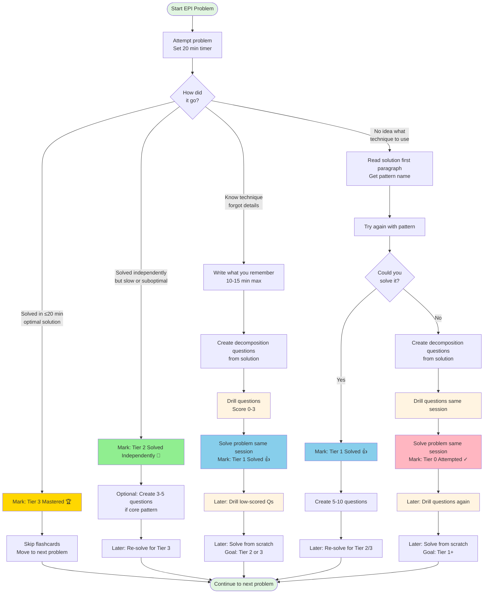

```mermaid
flowchart TD
    Start([Start EPI Problem]) --> Try[Attempt problem<br/>Set 20 min timer]
    Try --> HowDid{How did<br/>it go?}

    HowDid -->|Solved in ≤20 min<br/>optimal solution| Tier3[Mark: Tier 3 Mastered 🏆]
    Tier3 --> Skip[Skip flashcards<br/>Move to next problem]

    HowDid -->|Solved independently<br/>but slow or suboptimal| Tier2[Mark: Tier 2 Solved Independently 💪]
    Tier2 --> Optional[Optional: Create 3-5 questions<br/>if core pattern]
    Optional --> NextT2[Later: Re-solve for Tier 3]

    HowDid -->|Know technique<br/>forgot details| Write[Write what you remember<br/>10-15 min max]
    Write --> CreateQ2[Create decomposition questions<br/>from solution]
    CreateQ2 --> DrillT1[Drill questions<br/>Score 0-3]
    DrillT1 --> SolveT1[Solve problem same session<br/>Mark: Tier 1 Solved 👍]
    SolveT1 --> DrillLaterT1[Later: Drill low-scored Qs]
    DrillLaterT1 --> ResolveT1[Later: Solve from scratch<br/>Goal: Tier 2 or 3]

    HowDid -->|No idea what<br/>technique to use| ReadHint[Read solution first paragraph<br/>Get pattern name]
    ReadHint --> TryAgain[Try again with pattern]
    TryAgain --> StillStuck{Could you<br/>solve it?}

    StillStuck -->|Yes| SolveT1Alt[Mark: Tier 1 Solved 👍]
    SolveT1Alt --> CreateQ3[Create 5-10 questions]
    CreateQ3 --> ResolveT1Alt[Later: Re-solve for Tier 2/3]

    StillStuck -->|No| CreateQ1[Create decomposition questions<br/>from solution]
    CreateQ1 --> DrillT0[Drill questions same session]
    DrillT0 --> SolveT0[Solve problem same session<br/>Mark: Tier 0 Attempted ✓]
    SolveT0 --> DrillLaterT0[Later: Drill questions again]
    DrillLaterT0 --> ResolveT0[Later: Solve from scratch<br/>Goal: Tier 1+]

    Skip --> Done([Continue to next problem])
    NextT2 --> Done
    ResolveT1 --> Done
    ResolveT1Alt --> Done
    ResolveT0 --> Done

    style Start fill:#e1f5e1
    style Done fill:#e1f5e1
    style Tier3 fill:#ffd700
    style Tier2 fill:#90ee90
    style SolveT1 fill:#87ceeb
    style SolveT1Alt fill:#87ceeb
    style SolveT0 fill:#ffb6c1
    style DrillT1 fill:#fff4e1
    style DrillT0 fill:#fff4e1
    style DrillLaterT1 fill:#fff4e1
    style DrillLaterT0 fill:#fff4e1
```
