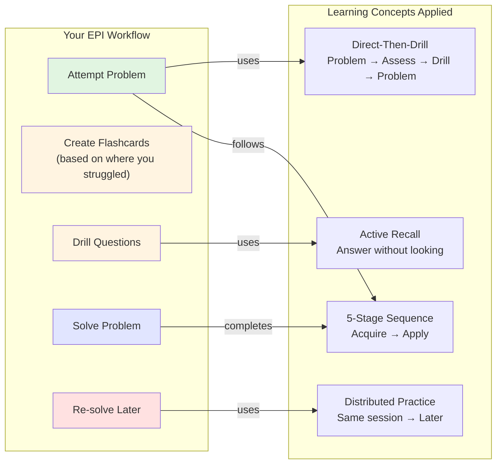

```mermaid
flowchart LR
    subgraph YourWorkflow["Your EPI Workflow"]
        Attempt["Attempt Problem"]
        Create["Create Flashcards<br/>(based on where you struggled)"]
        DrillQ["Drill Questions"]
        Solve["Solve Problem"]
        Later["Re-solve Later"]
    end

    subgraph Concepts["Learning Concepts Applied"]
        DD["Direct-Then-Drill<br/>Problem → Assess → Drill → Problem"]
        AR["Active Recall<br/>Answer without looking"]
        Dist["Distributed Practice<br/>Same session → Later"]
        Seq["5-Stage Sequence<br/>Acquire → Apply"]
    end

    Attempt -->|uses| DD
    Attempt -->|follows| Seq
    DrillQ -->|uses| AR
    Later -->|uses| Dist
    Solve -->|completes| Seq

    style Attempt fill:#e1f5e1
    style Create fill:#fff4e1
    style DrillQ fill:#fff4e1
    style Solve fill:#e1e5ff
    style Later fill:#ffe1e1
```
