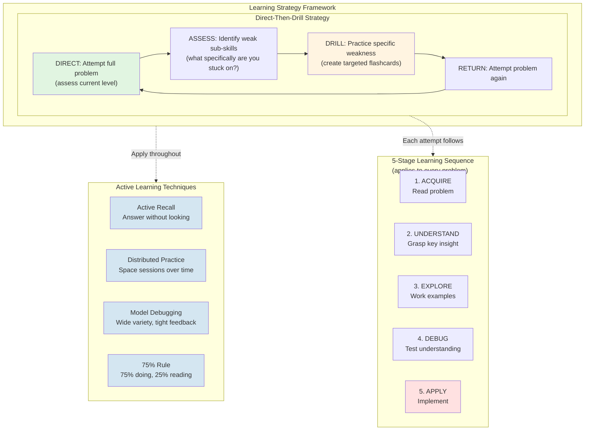

```mermaid
flowchart TB
    subgraph Learning["Learning Strategy Framework"]
        direction TB

        subgraph DirectDrill["Direct-Then-Drill Strategy"]
            Direct["DIRECT: Attempt full problem<br/>(assess current level)"]
            Assess["ASSESS: Identify weak sub-skills<br/>(what specifically are you stuck on?)"]
            Drill["DRILL: Practice specific weakness<br/>(create targeted flashcards)"]
            Return["RETURN: Attempt problem again"]
        end

        Direct --> Assess --> Drill --> Return --> Direct
    end

    subgraph Techniques["Active Learning Techniques"]
        direction LR
        AR["Active Recall<br/>Answer without looking"]
        DP["Distributed Practice<br/>Space sessions over time"]
        MD["Model Debugging<br/>Wide variety, tight feedback"]
        Rule75["75% Rule<br/>75% doing, 25% reading"]
    end

    subgraph Sequence["5-Stage Learning Sequence<br/>(applies to every problem)"]
        direction LR
        Acquire["1. ACQUIRE<br/>Read problem"]
        Understand["2. UNDERSTAND<br/>Grasp key insight"]
        Explore["3. EXPLORE<br/>Work examples"]
        Debug["4. DEBUG<br/>Test understanding"]
        Apply["5. APPLY<br/>Implement"]
    end

    Learning -.->|Apply throughout| Techniques
    DirectDrill -.->|Each attempt follows| Sequence

    style Direct fill:#e1f5e1
    style Drill fill:#fff4e1
    style Apply fill:#ffe1e1
    style AR fill:#d4e6f1
    style DP fill:#d4e6f1
    style MD fill:#d4e6f1
    style Rule75 fill:#d4e6f1
```
