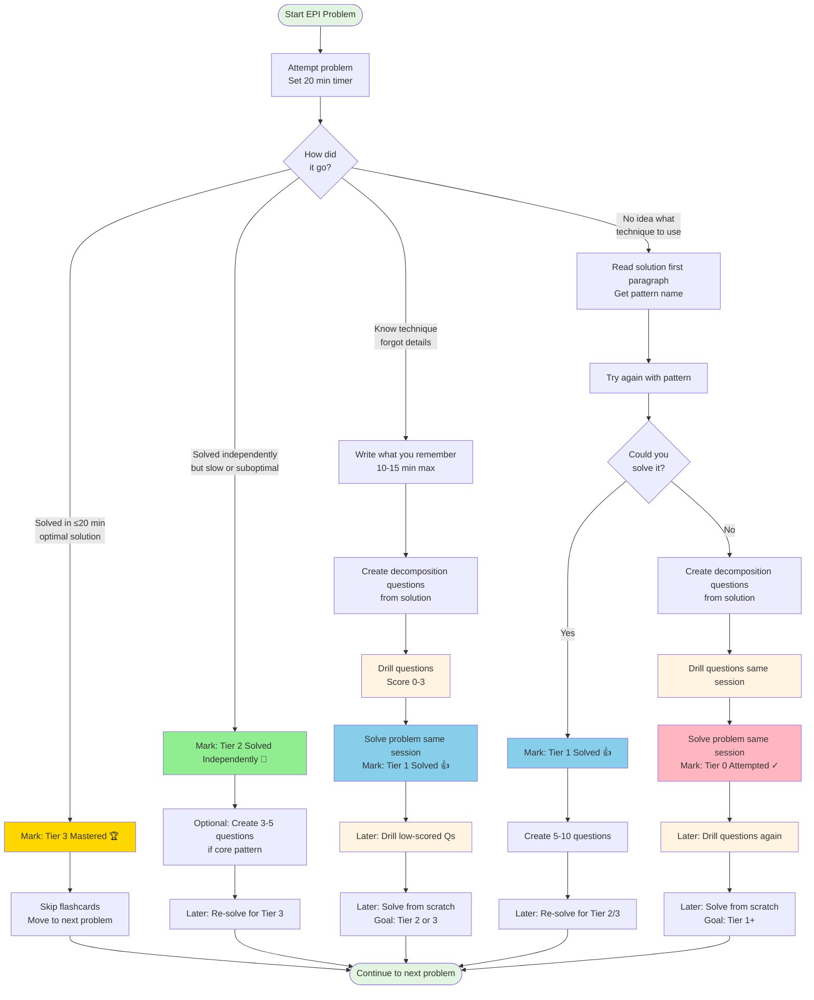
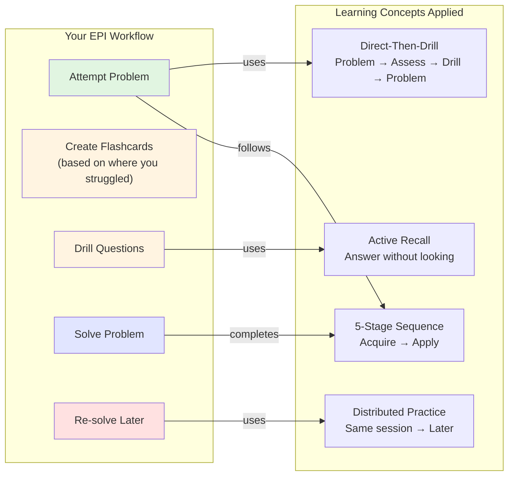
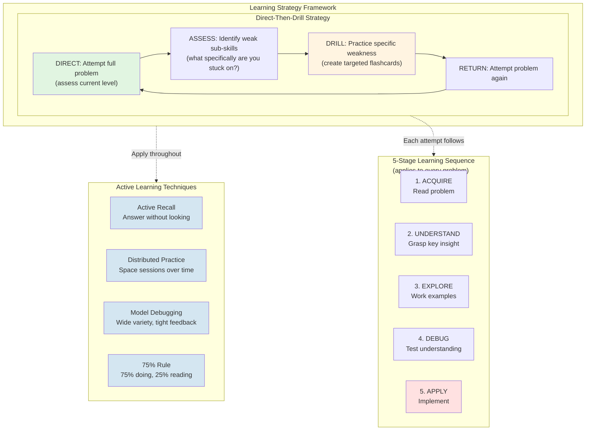

# Problem-Solving Workflow

Visual guides for the EPI problem-solving approach and learning framework.

## EPI Problem Workflow

```mermaid
flowchart TD
    Start([Start EPI Problem]) --> Try[Attempt problem<br/>Set 20 min timer]
    Try --> HowDid{How did<br/>it go?}

    HowDid -->|Solved in ≤20 min<br/>optimal solution| Tier3[Mark: Tier 3 Mastered 🏆]
    Tier3 --> Skip[Skip flashcards<br/>Move to next problem]

    HowDid -->|Solved independently<br/>but slow or suboptimal| Tier2[Mark: Tier 2 Solved Independently 💪]
    Tier2 --> Optional[Optional: Create 3-5 questions<br/>if core pattern]
    Optional --> NextT2[Later: Re-solve for Tier 3]

    HowDid -->|Know technique<br/>forgot details| Write[Write what you remember<br/>10-15 min max]
    Write --> CreateQ2[Create decomposition questions<br/>from solution]
    CreateQ2 --> DrillT1[Drill questions<br/>Score 0-3]
    DrillT1 --> SolveT1[Solve problem same session<br/>Mark: Tier 1 Solved 👍]
    SolveT1 --> DrillLaterT1[Later: Drill low-scored Qs]
    DrillLaterT1 --> ResolveT1[Later: Solve from scratch<br/>Goal: Tier 2 or 3]

    HowDid -->|No idea what<br/>technique to use| ReadHint[Read solution first paragraph<br/>Get pattern name]
    ReadHint --> TryAgain[Try again with pattern]
    TryAgain --> StillStuck{Could you<br/>solve it?}

    StillStuck -->|Yes| SolveT1Alt[Mark: Tier 1 Solved 👍]
    SolveT1Alt --> CreateQ3[Create 5-10 questions]
    CreateQ3 --> ResolveT1Alt[Later: Re-solve for Tier 2/3]

    StillStuck -->|No| CreateQ1[Create decomposition questions<br/>from solution]
    CreateQ1 --> DrillT0[Drill questions same session]
    DrillT0 --> SolveT0[Solve problem same session<br/>Mark: Tier 0 Attempted ✓]
    SolveT0 --> DrillLaterT0[Later: Drill questions again]
    DrillLaterT0 --> ResolveT0[Later: Solve from scratch<br/>Goal: Tier 1+]

    Skip --> Done([Continue to next problem])
    NextT2 --> Done
    ResolveT1 --> Done
    ResolveT1Alt --> Done
    ResolveT0 --> Done

    style Start fill:#e1f5e1
    style Done fill:#e1f5e1
    style Tier3 fill:#ffd700
    style Tier2 fill:#90ee90
    style SolveT1 fill:#87ceeb
    style SolveT1Alt fill:#87ceeb
    style SolveT0 fill:#ffb6c1
    style DrillT1 fill:#fff4e1
    style DrillT0 fill:#fff4e1
    style DrillLaterT1 fill:#fff4e1
    style DrillLaterT0 fill:#fff4e1
```

## Learning Framework

```mermaid
flowchart LR
    subgraph YourWorkflow["Your EPI Workflow"]
        Attempt["Attempt Problem"]
        Create["Create Flashcards<br/>(based on where you struggled)"]
        DrillQ["Drill Questions"]
        Solve["Solve Problem"]
        Later["Re-solve Later"]
    end

    subgraph Concepts["Learning Concepts Applied"]
        DD["Direct-Then-Drill<br/>Problem → Assess → Drill → Problem"]
        AR["Active Recall<br/>Answer without looking"]
        Dist["Distributed Practice<br/>Same session → Later"]
        Seq["5-Stage Sequence<br/>Acquire → Apply"]
    end

    Attempt -->|uses| DD
    Attempt -->|follows| Seq
    DrillQ -->|uses| AR
    Later -->|uses| Dist
    Solve -->|completes| Seq

    style Attempt fill:#e1f5e1
    style Create fill:#fff4e1
    style DrillQ fill:#fff4e1
    style Solve fill:#e1e5ff
    style Later fill:#ffe1e1
```

## Learning Strategy Framework

```mermaid
flowchart TB
    subgraph Learning["Learning Strategy Framework"]
        direction TB

        subgraph DirectDrill["Direct-Then-Drill Strategy"]
            Direct["DIRECT: Attempt full problem<br/>(assess current level)"]
            Assess["ASSESS: Identify weak sub-skills<br/>(what specifically are you stuck on?)"]
            Drill["DRILL: Practice specific weakness<br/>(create targeted flashcards)"]
            Return["RETURN: Attempt problem again"]
        end

        Direct --> Assess --> Drill --> Return --> Direct
    end

    subgraph Techniques["Active Learning Techniques"]
        direction LR
        AR["Active Recall<br/>Answer without looking"]
        DP["Distributed Practice<br/>Space sessions over time"]
        MD["Model Debugging<br/>Wide variety, tight feedback"]
        Rule75["75% Rule<br/>75% doing, 25% reading"]
    end

    subgraph Sequence["5-Stage Learning Sequence<br/>(applies to every problem)"]
        direction LR
        Acquire["1. ACQUIRE<br/>Read problem"]
        Understand["2. UNDERSTAND<br/>Grasp key insight"]
        Explore["3. EXPLORE<br/>Work examples"]
        Debug["4. DEBUG<br/>Test understanding"]
        Apply["5. APPLY<br/>Implement"]
    end

    Learning -.->|Apply throughout| Techniques
    DirectDrill -.->|Each attempt follows| Sequence

    style Direct fill:#e1f5e1
    style Drill fill:#fff4e1
    style Apply fill:#ffe1e1
    style AR fill:#d4e6f1
    style DP fill:#d4e6f1
    style MD fill:#d4e6f1
    style Rule75 fill:#d4e6f1
```
